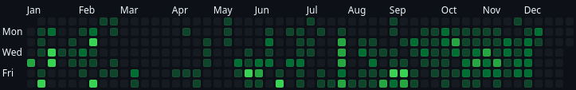
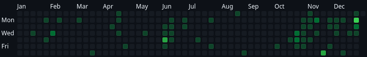

.`2024.09.07` _okay but..._
[%collapsible]
====
[discrete]
== `2024.09.07`

okay but why do 100 people "follow" this account...?

you guys are weird
====

.`2024.11.30` _ヤーーーァ　レン　ソーラン…_

[%collapsible]
====
[discrete]
== `2024.11.30`

_ヤーーーァ　レン　ソーラン　ソーラン　ソーラン　ソーラン　ソーラン…_ +
^_はい　はい！_^

_ここのフレーズあんまり　考えたくはないのでスルー_

_チョイ ヤサ エン　エンヤーーーァ…_ +
^_はっ　はっ！　　はっ　はっ！　　はっ　はっ！_^

_サーの　ドッコイショ…　サーの　ドッコイショ…_ +
^_はい　はい！　はい　はい！_^

^_はー　どっこいしょ！_^ +
_ハー　ドッコイショ！　ドッコイショ！_ +
^_どっこいしょ！　どっこいしょ！_^

_ソーラン！　ソーラン！_ +
^_そーらん！　そーらん！_^
====

.`2024.12.10` _the weirdest thing..._
[%collapsible]
====
[discrete]
== `2024.12.10`

the weirdest thing is how consistently active this account is this year compared to previous years.

.2024
--

--

.2023
--

--
====
